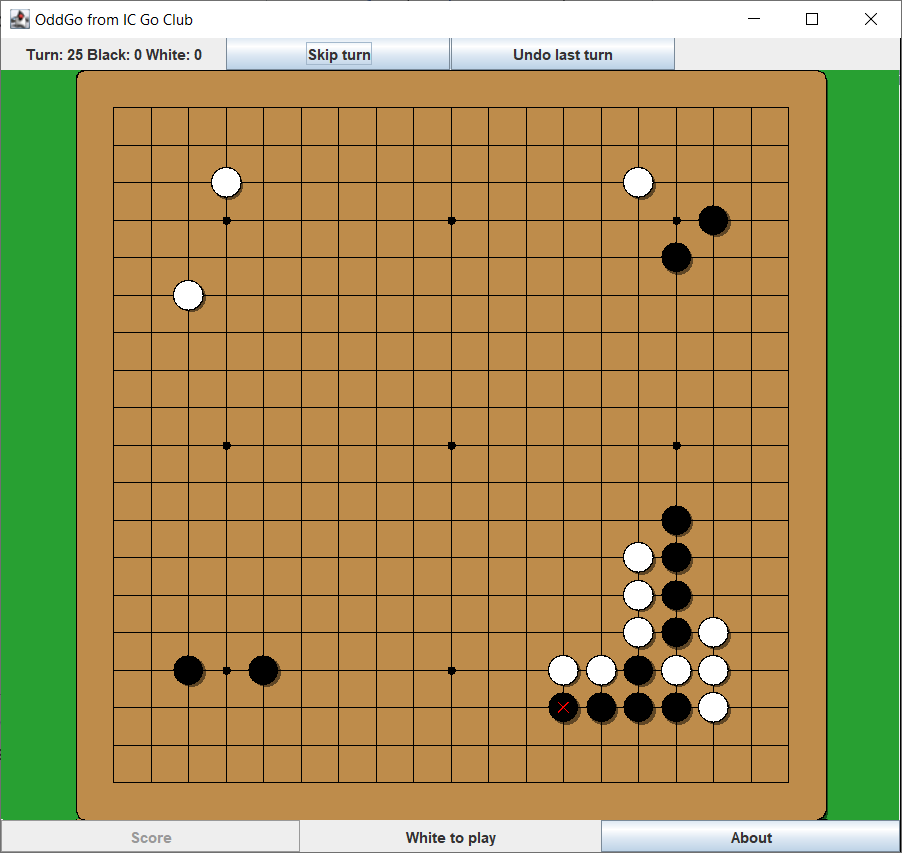
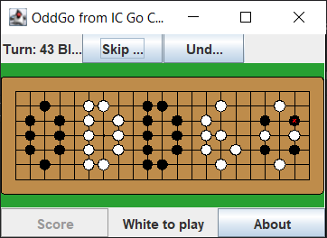
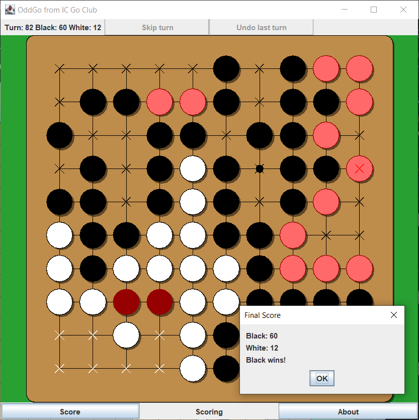

OddGo
-
2-player local Go game written in Java with Swing.

The ear-reddening game played on September 11, 1846, between Honinbo Shusaku (black) and Inoue Genan Inseki (white).

Features
-

Non-standard board sizes are supported and the display is responsive - resize the game window however you want.

Scoring
-

End the game by skipping both players' turns. Identify dead groups and territories, and OddGo will calculate the score.
